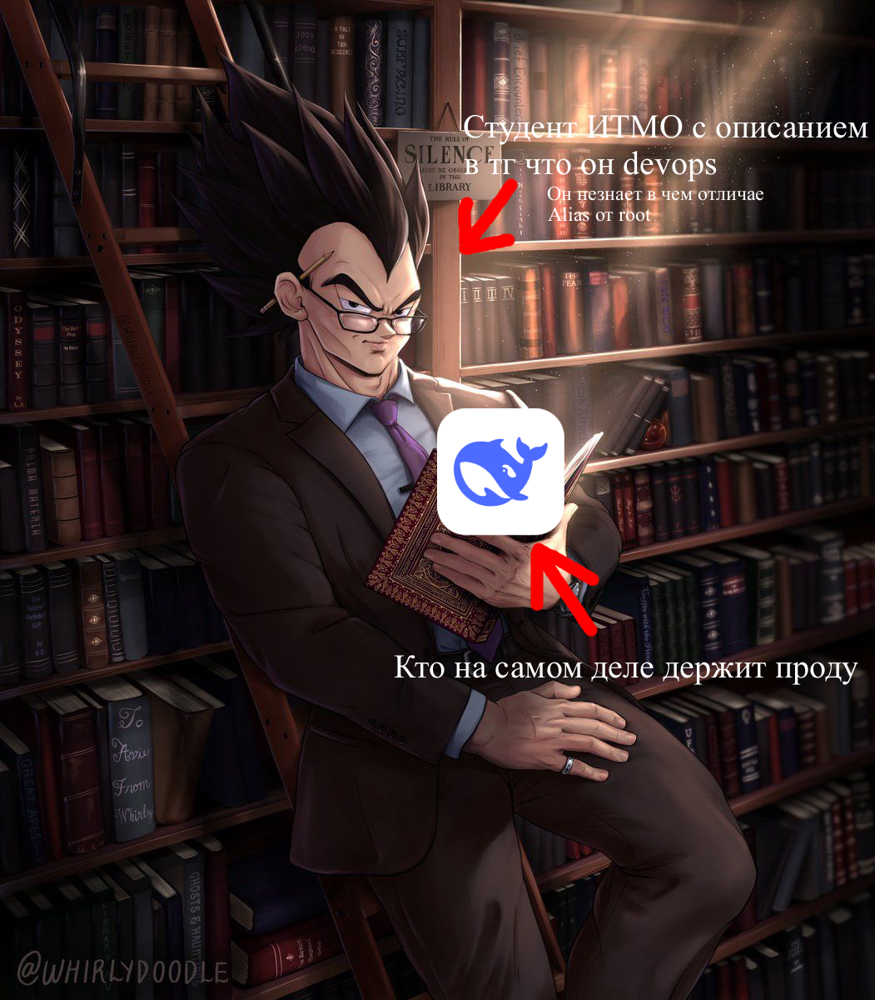
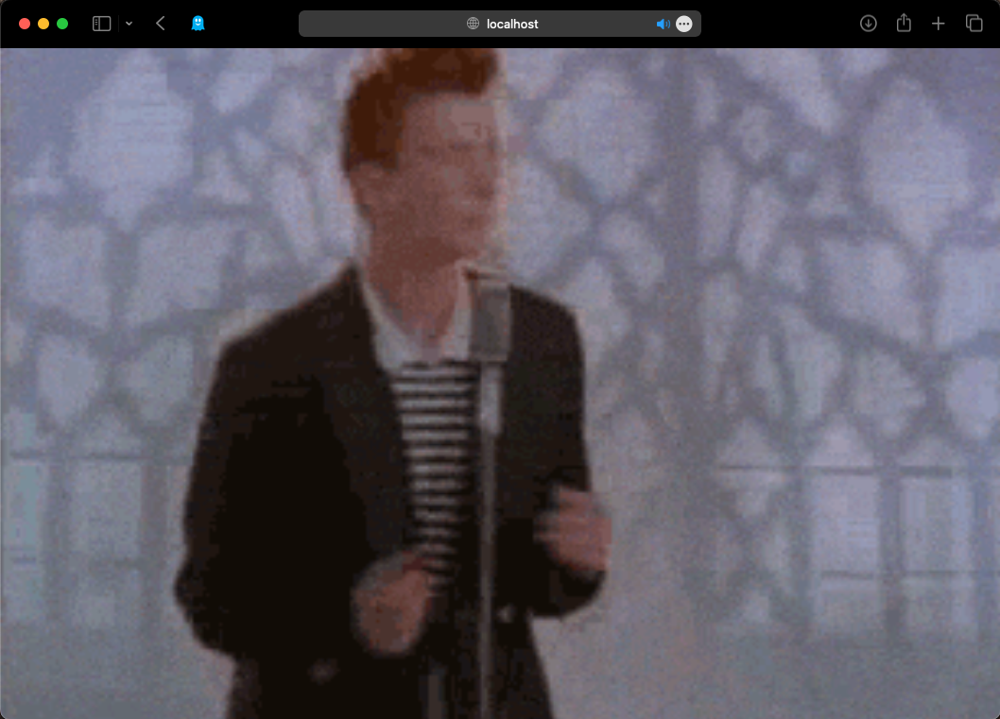
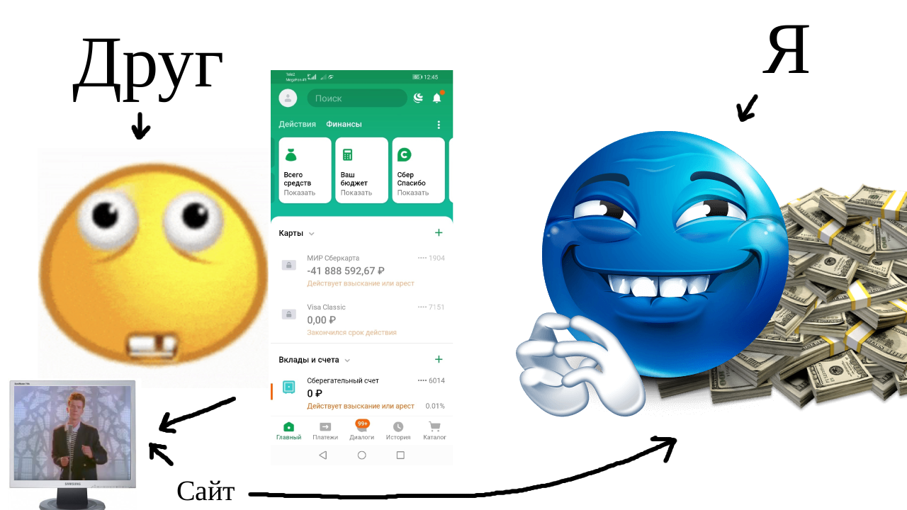
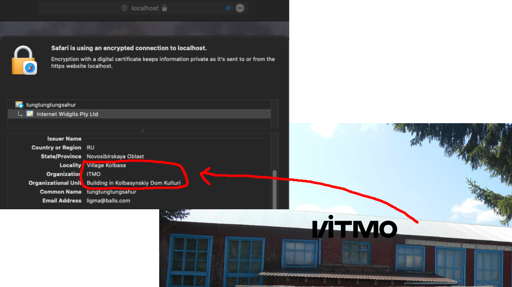
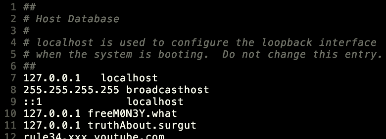
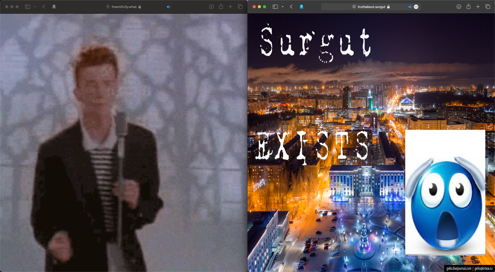

# Лаба 1 

> Данный отчет содержит нездоровую норму шизы

Честно я даже не сильно знаю что в отчёте писать буквально по той причине, что это просто поэтапная история
требующая от тебя зайти на ютуб посмотреть максимум 5 видосов или о боже пойти всё запромтить в китайского синнего кита 


рис. 1 Типичный студент ИТМО

## Реально поднимаем nginx

Обременять я себя не стал и пошел все делать на пингвино-подобной системе (на самом деле это мак).
И nginx просто качается через пакетный менеджер и потом просто запускается как сервис.
Все буду делать в nginx.conf (уверен что прода перевернулась в гробу от таких фокусов)

А вот и первый конфиг:
```nginx
worker_processes  1; #комп переживет

events {
    worker_connections  1024; #особенно такое количество пользователей
}

http {
    sendfile        on;

    server {
        listen       80;
        server_name  rickroll;

        location / {
            root   /Users/bebra/Documents/Cloud;
            index  freeM0N3Y.html;
        }
    }
}
```
Пока что просто решил понять один сайт на localhost (домены пропишу позже) (и да сайт сгенирил deepseek я не шарю за веб)
 
А вот и результат:


рис. 2 ВТФ ЭТО РИК ЭШЛИ??????

Сайт с ничем не угрожающим риклом поднят! Осталось прокинуть порты в роутере, купит домен и отправить всем друзьям, которые не подозревают что это кукиграбер.


рис. 3 Иженерная схема: Реакция моих друзей на прикол

Но я все таки хороший друг и не хочу чтобы злой и потный дядька, который не смог закончить БИТ в ИТМО и сидит ищет сайты которые можно ломанут, своровал данные моих друзей (их деньги только мои). Поэтому нам нужно защитить сайт сертификатом (к сожалению самописным, но ничего закину друзьям его njrat'ом в их компе)

Сначало сделаем Cerificate Authority чтобы клипать эти сертификаты как дети клипают iphone'ы на китайских фабриках:
```bash
openssl genrsa -aes256 -out ca.key 4096
openssl req -new -x509 -sha256 -days 69 -key ca.key -out ca.pem
```
Сгенерим ключ для сертификатов
```bash
openssl genrsa -out cert.key 4096
openssl req -new -key cert.key -out cert.csr
```
В ext файле распишем на какие днс распростроняется
```bash
touch extfile.ext 
echo "subjectAltName=DNS:localhost" >> extfile.ext 
```
Делаем сертификиат
```bash
openssl x509 -req -sha256 -days 69 -in cert.csr -CA ca.pem -CAkey ca.key -out cert.crt -extfile extfile.ext
```

Ура! теперь мы можем защитить 10000% абсолютно "важные" данные от всяких хацкеров

Теперь осталось сделать переброс каждого http запроса на https и добавить сертификаты в конфиг
```nginx
server {
        listen       80;
        location / {
            return 301 https://$host$request_uri;
        }
    }


 server {
    listen       443 ssl;
    server_name  rickroll;

    ssl_certificate      /Users/bebra/Documents/Cloud/cert.crt;
    ssl_certificate_key  /Users/bebra/Documents/Cloud/cert.key;

    location / {
        root   /Users/bebra/Documents/Cloud;
        index  freeM0N3Y.html;
    }
}
```

Вот что вышло:


rice. 4 Рик Эшли начал танцевать в честь установленного https соединения

Результат на глаза! Возле url'а появляся целый замочек! Ладно если серьезно то у нас теперь локально наконец-то всё по https и чтобы всё работало надо было добавить сертификат в комп. Также большое спасибо студентам с корпуса ИТМО в деревне Колбаса с направления КТ (Колбасные Технологии в компьютерном промысле), что помогли сделать сертификат. 


рис. 5 СПАСИБО ДЕРЕВНЕ КОЛБАСА!!!!!!

Теперь пропишем хосты чтобы поднять еще один "проект" из двух сайтов с чистым html и css


рис. 6(7) просто хосты

На втором сайте сделаю просто alias потому что часть сайта лежит в той же что и главная
```nginx
server {
        listen       443 ssl;
        server_name  truthAbout.surgut;

        ssl_certificate      /Users/bebra/Documents/Cloud/cert.crt;
        ssl_certificate_key  /Users/bebra/Documents/Cloud/cert.key;

        location / {
            root   /Users/bebra/Documents/Cloud;
            index  truthAbout.html;
        }

        location /realtruth {
            alias /Users/bebra/Documents/Cloud;
            index realtruthAbout.html;
        } 
    }
```
Теперь тайна о сургуте сокрыта, а все сайты прекрасно работают


рис 7. freeM0N3Y.what и truthAbout.surgut как перспективные проекты русского IT


р̷͔̚и̵̌͜с̴̗͚̓̊̎ ̶̳̞̯͎̿8̵̥̩͎́.̷̨̪͎͈̔ ̵̻͓̜̅́̾С̷͖͇̺͘У̴͔͙̓Р̷͉̭̜̏Г̷̱̩̋͒У̷̤͓̮̊Т̵̧̱̯̟̓А̸̹͓̰́̎ͅ ̸̧̯͎̆̌̓͝Н̴̝͓͓͊̃̊Е̷̱͒ ̴̨̛̭̞͔̈́͊͝С̴͈͔̞̰̽̐̆У̵̡̦̟̑̐̽̕Щ̷͔̓̈̓͌Е̸̨͙͍̫́С̸͈͊̀́̈Т̵̲̊В̷̠͖́У̵̝̏͆̎͘Е̷̘͖̩̯͋̇͘Т̴̲̯͗̈̏

Ну и вот финальный конфиг
```nginx
worker_processes  1;

events {
    worker_connections  1024;
}

http {

    sendfile        on;

    server {
        listen       80;
        location / {
            return 301 https://$host$request_uri;
        }
    }


    server {
        listen       443 ssl;
        server_name  freeM0N3Y.what;

        ssl_certificate      /Users/bebra/Documents/Cloud/cert.crt;
        ssl_certificate_key  /Users/bebra/Documents/Cloud/cert.key;

        location / {
            root   /Users/bebra/Documents/Cloud;
            index  freeM0N3Y.html;
        }
    }

    server {
        listen       443 ssl;
        server_name  truthAbout.surgut;

        ssl_certificate      /Users/bebra/Documents/Cloud/cert.crt;
        ssl_certificate_key  /Users/bebra/Documents/Cloud/cert.key;

        location / {
            root   /Users/bebra/Documents/Cloud;
            index  truthAbout.html;
        }

        location /realtruth {
            alias /Users/bebra/Documents/Cloud;
            index realtruthAbout.html;
        } 
    }
}
```
## А че в целом в итоге
Ну было прикольно разобратся и понять как поднимать всю историю. Жаль материала вузовскго нету. В детали погрузится было бы с кайфом.
А так вся работа выполялась примерно в таком виде со спотиком в котором играла энергичная музыкай на фоне:

