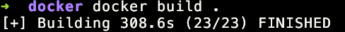
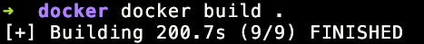

# Лаба 2

Из того что я прочитал, что есть на сайте докера (буквально есть раздел best practices), в ошибоках линтера hadolint и в ответе другого синего кита все best practices сводятся к трем вещам:

* Избегать лишнего
* Безопасность
* Стабильность

Первое напрямую влияет на размер образа и скорость сборки. Второе небходимость почти везде. Третье если не хочешь чтобы тебя уволили за ущерб в миллионы рублей, потому что прода упала из-за патча в котором поменялся один бит данных.

## Хорошие практики
Из практитк для отсутвия ненужного:

* Multi-Stage сборка чтобы на результате иметь только то что нужно
* Стараться в меньше команд (Команды это "слои" которые кэшируются) 
* Вцелом чистить кэш внутри контейнера (и мусор в доме тоже)

Из практик для безопасности:

* Бога ради не хардкодь API ключи и другие важные вещи
* Даже внутри контейнера root незя (Не стоит давать излишнии права пользователю в контейнере)
* Пакеты безопасны по последним стандартам

Из практик для стабильности:

* Версии пакетов и образов явно с указанной версией (Если надо зафиксировано на один из update'ов)
* А в целом незнаю что ещё

## Погнали писать кал🥰😝😎

Я попросил  китайского синего брата сгенирить плохой файл и то что он сгенерировал это ***Absolute Cinema***. А вот и наш кандидат на позор года 
```dockerfile
FROM ubuntu:latest 

RUN apt-get update
RUN apt-get upgrade -y
RUN apt-get install -y wget curl git vim nano emacs 

RUN apt-get install -y gcc
RUN apt-get install -y g++
RUN apt-get install -y build-essential

RUN mkdir /app
RUN mkdir /app/src
RUN mkdir /app/build
RUN mkdir /app/output

COPY . /app/src/

WORKDIR /app/src
WORKDIR /app/build
WORKDIR /app/src

RUN g++ -g -O0 main.cpp -o /app/output/hello

WORKDIR /app/output

CMD ["./hello"]

EXPOSE 8080  
```
И помоему он немного барщанул. Начиная от какого просто безумного количество слоев до открытия порта💀
Из плохих практик выбран слишком большой изначальный образ, не указана явная версия начального образа, огромное количество слоев и в том числе не нужных, бинарник запущен из под root'а, и вполне можно было сделать multi-stage 

Впринципе это чудо по весу может спокойно соревноватся со среднестатистическим жителем америки

Собирается все тоже довольно долго



## Исправляем🫡
```dockerfile
FROM gcc:11-bullseye as builder

COPY main.cpp .
RUN g++ main.cpp -static -o hello

FROM scratch
COPY --from=builder /hello /hello
CMD ["./hello"]
```
Поменялось буквально все... начальный образ оптимален, запускаемся из под scratch, лишних слоев нету я считаю это полный гол
По весу все теперь по моему здраво

Ну а время сборки если быть честным что в прошлом что в этом случае съела скачка ресурсов, но в обоих случаях на скачку ушло 200сек


## Плохие практики с контейнерами

* Делать контейнеры слишком сложными для пересборки и замены (То есть не [Ephemeral](https://docs.docker.com/build/building/best-practices/#create-ephemeral-containers$0) контейнеры)
* Запускать несколько приложений из под одного контейнера (Убивает идею контейнеров и модульность)
